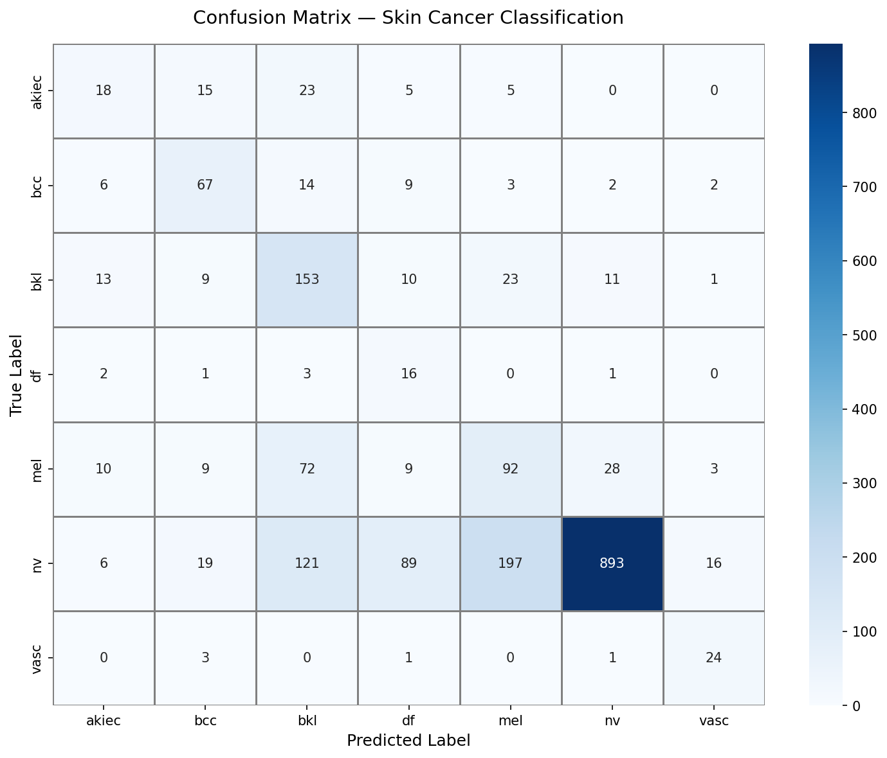
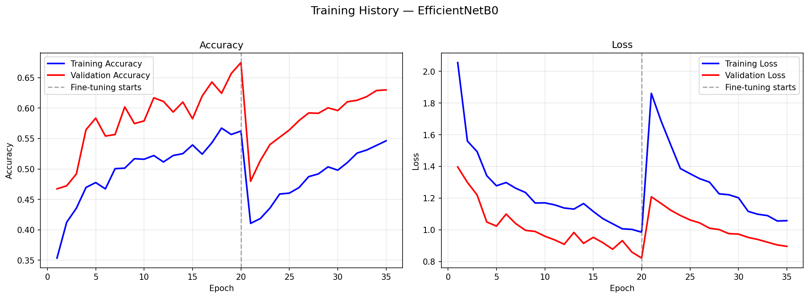

<div align="center">

# 🔬 DermaScan AI — Skin Cancer Detection

**An industrial-grade skin lesion classifier powered by EfficientNetB0 transfer learning**

[](https://python.org)
[](https://tensorflow.org)
[](https://streamlit.io)
[](LICENSE)

*Classify dermoscopic skin lesion images into 7 diagnostic categories with deep learning*

[🚀 Live Demo](#) · [📖 Documentation](#model-architecture) · [🐛 Report Bug](../../issues)

</div>

---

## 📋 Table of Contents

- [Overview](#overview)
- [Dataset](#dataset)
- [Model Architecture](#model-architecture)
- [Installation](#installation)
- [Usage](#usage)
- [Results](#results)
- [Web Application](#web-application)
- [Deployment](#deployment)
- [Project Structure](#project-structure)
- [Contributing](#contributing)
- [License](#license)

---

## Overview

DermaScan AI is a deep learning application that classifies dermoscopic images of skin lesions into **7 diagnostic categories**. The model uses **EfficientNetB0** with a two-phase transfer learning strategy to achieve high accuracy even with severe class imbalance.

### Key Features

- 🧠 **EfficientNetB0** backbone with ImageNet pre-trained weights
- ⚖️ **Class-balanced training** using computed sample weights
- 🔄 **Two-phase training**: feature extraction → fine-tuning
- 📊 **Comprehensive evaluation**: confusion matrix, F1-scores, training curves
- 🌐 **Production web app** built with Streamlit
- 🎨 **Premium dark UI** with medical-grade information display

---

## Dataset

This project uses the [HAM10000 dataset](https://www.kaggle.com/datasets/kmader/skin-cancer-mnist-ham10000) ("Human Against Machine with 10,000 training images"), a benchmark dataset for dermatoscopic image classification.

| Class | Description | Samples | % | Risk Level |
|-------|------------|---------|---|------------|
| `nv` | Melanocytic Nevi (Moles) | ~6,705 | 67% | ✅ Benign |
| `mel` | Melanoma | ~1,113 | 11% | 🔴 Cancerous |
| `bkl` | Benign Keratosis | ~1,099 | 11% | ✅ Benign |
| `bcc` | Basal Cell Carcinoma | ~514 | 5% | 🔴 Cancerous |
| `akiec` | Actinic Keratoses | ~327 | 3% | ⚠️ Pre-cancerous |
| `vasc` | Vascular Lesions | ~142 | 1.4% | ✅ Benign |
| `df` | Dermatofibroma | ~115 | 1.1% | ✅ Benign |

> ⚠️ **Class Imbalance**: The `nv` class has ~58× more samples than `df`. This is handled via computed class weights during training.

---

## Model Architecture

```
Input Image (224 × 224 × 3)
         │
         ▼
┌─────────────────────────┐
│    EfficientNetB0       │  ← ImageNet pre-trained weights
│    (Feature Extractor)  │
└─────────────────────────┘
         │
         ▼
  GlobalAveragePooling2D
         │
         ▼
    BatchNormalization
         │
         ▼
   Dense(256, ReLU)
         │
         ▼
    Dropout(0.5)
         │
         ▼
   Dense(128, ReLU)
         │
         ▼
    Dropout(0.3)
         │
         ▼
  Dense(7, Softmax)  →  Prediction
```

### Training Strategy

| Phase | Strategy | Learning Rate | Epochs |
|-------|----------|--------------|--------|
| **Phase 1** | Feature Extraction (frozen base) | 1e-3 | 20 |
| **Phase 2** | Fine-Tuning (unfreeze top layers) | 1e-5 | 15 |

### Key Techniques

- **Class Weights**: Computed via `sklearn.compute_class_weight("balanced")`
- **Data Augmentation**: Random flip, rotation, zoom, contrast, brightness, translation
- **Early Stopping**: Monitors `val_loss` with patience=5
- **Learning Rate Scheduling**: `ReduceLROnPlateau` (factor=0.5, patience=3)

---

## Installation

### Prerequisites

- Python 3.10+
- NVIDIA GPU with CUDA (recommended) or CPU
- Git LFS (for model files)

### Setup

```bash
# 1. Clone the repository
git clone https://github.com/YOUR_USERNAME/skin-cancer-detection.git
cd skin-cancer-detection

# 2. Install Git LFS (if not already installed)
git lfs install

# 3. Create virtual environment
python -m venv venv
venv\Scripts\activate       # Windows
# source venv/bin/activate  # Linux/macOS

# 4. Install dependencies
pip install -r requirements.txt
```

---

## Usage

### Step 1: Prepare the Dataset

Download the [HAM10000 dataset](https://www.kaggle.com/datasets/kmader/skin-cancer-mnist-ham10000) from Kaggle and run:

```bash
python src/prepare_data.py \
    --raw_dir "path/to/HAM10000_images_part_1" "path/to/HAM10000_images_part_2" \
    --metadata "path/to/HAM10000_metadata.csv"
```

This organizes images into class-specific subfolders and creates an 80/20 train/val split.

### Step 2: Train the Model

```bash
# Full training (Phase 1 + Phase 2)
python src/train.py

# Custom configuration
python src/train.py --epochs_phase1 25 --epochs_phase2 15 --batch_size 16

# Quick test (feature extraction only)
python src/train.py --epochs_phase1 5 --skip_phase2
```

### Step 3: Launch the Web App

```bash
streamlit run app.py
```

The app will open at `http://localhost:8501`.

---

## Results

After training, the following artifacts are generated in the `models/` directory:

- `best_model.keras` — Trained model weights
- `confusion_matrix.png` — Classification confusion matrix
- `training_history.png` — Accuracy and loss curves
- `classification_report.txt` — Per-class precision, recall, F1-score
- `class_names.json` — Ordered class labels

<!-- Uncomment after training and add your actual results:
### Performance Metrics

| Metric | Value |
|--------|-------|
| Validation Accuracy | XX.X% |
| Weighted F1-Score | X.XXX |
| Melanoma Recall | XX.X% |

### Confusion Matrix



### Training History


-->

---

## Web Application

The Streamlit app provides:

- 📤 **Drag-and-drop** image upload
- 🔍 **Real-time prediction** with confidence scores
- 📊 **Confidence bar chart** for all 7 classes
- ℹ️ **Detailed class descriptions** with risk levels
- 📈 **Model performance** dashboard
- ⚕️ **Medical disclaimer** and action recommendations

---

## Deployment

### Streamlit Community Cloud (Recommended)

1. Push your repo to GitHub
2. Go to [share.streamlit.io](https://share.streamlit.io)
3. Select your repository, branch, and `app.py`
4. Deploy!

### Git LFS for Model Files

This project uses Git LFS to track large model files (`.keras`, `.h5`):

```bash
# Track model files
git lfs track "*.keras"
git lfs track "*.h5"

# Verify tracking
git lfs ls-files

# Push to remote
git push origin main
```

---

## Project Structure

```
skin-cancer-detection/
├── data/                          # Dataset (not committed — .gitignored)
│   ├── train/                     # Training images (7 class folders)
│   └── val/                       # Validation images (7 class folders)
├── models/                        # Trained models & evaluation artifacts
│   ├── best_model.keras           # Final trained model (Git LFS)
│   ├── confusion_matrix.png       # Confusion matrix heatmap
│   ├── training_history.png       # Accuracy/loss curves
│   ├── classification_report.txt  # Per-class metrics
│   └── class_names.json           # Ordered class labels
├── src/
│   ├── prepare_data.py            # Dataset organization & splitting
│   └── train.py                   # Production training script
├── .streamlit/
│   └── config.toml                # Streamlit theme configuration
├── app.py                         # Streamlit web application
├── requirements.txt               # Python dependencies
├── .gitignore                     # Git ignore rules
├── .gitattributes                 # Git LFS tracking rules
└── README.md                      # This file
```

---

## Contributing

Contributions are welcome! Please:

1. Fork the repository
2. Create a feature branch (`git checkout -b feature/amazing-feature`)
3. Commit your changes (`git commit -m 'Add amazing feature'`)
4. Push to the branch (`git push origin feature/amazing-feature`)
5. Open a Pull Request

---

## License

This project is licensed under the MIT License — see the [LICENSE](LICENSE) file for details.

---

## Acknowledgments

- **Dataset**: [HAM10000](https://dataverse.harvard.edu/dataset.xhtml?persistentId=doi:10.7910/DVN/DBW86T) by Tschandl et al.
- **Model**: [EfficientNet](https://arxiv.org/abs/1905.11946) by Tan & Le (Google Brain)
- **Framework**: TensorFlow / Keras

---

<div align="center">

**⚕️ This tool is for educational purposes only. Always consult a medical professional.**

Made with ❤️ by [Your Name]

</div>
